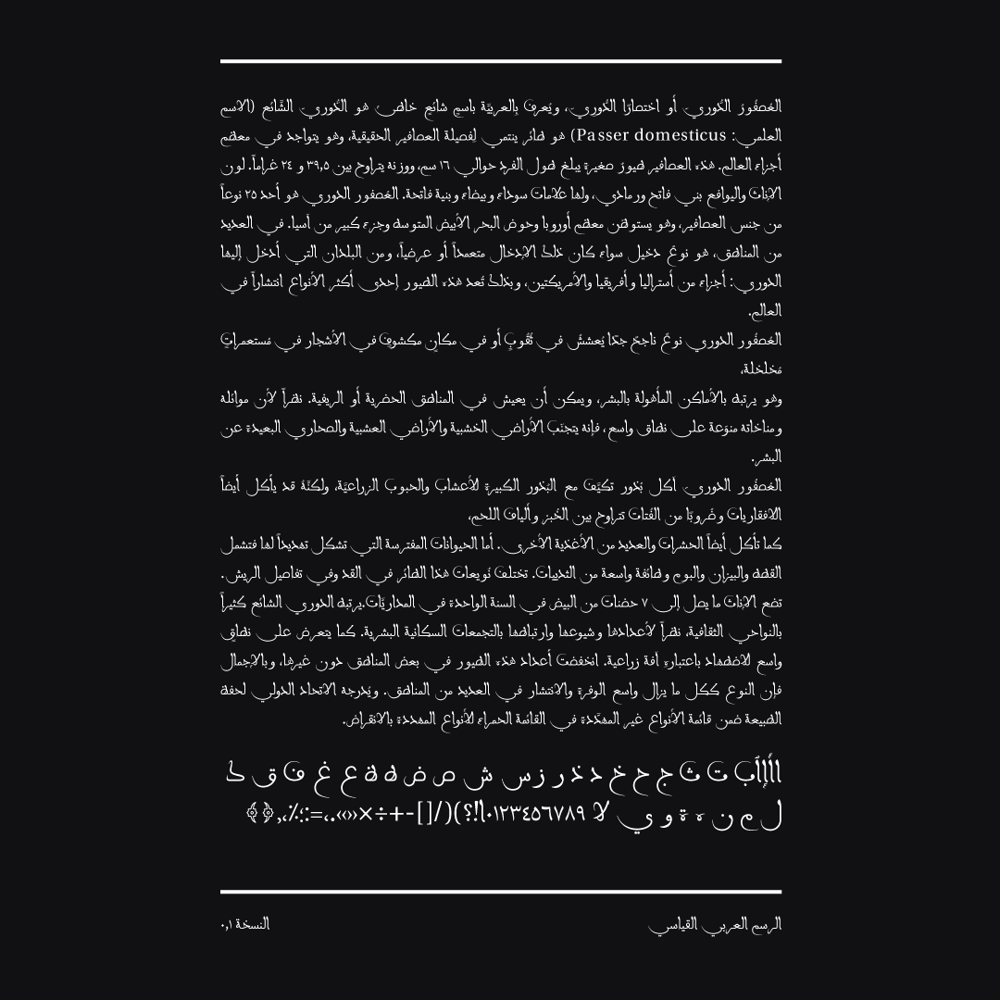

# Bouazzi Maghribi Font Project

Bouazzi Maghribi is an open-source revival of a classic Arabic font based on the Maghribi script. This project is dedicated to the memory of the late Dr. Ahmed Bouazzi.

## Overview

The Bouazzi Maghribi font project aims to bring back the elegance and intricate detail of the traditional Maghribi script in a format that can be used in the digital age. This font was meticulously crafted to preserve the original characteristics and spirit of the Maghribi script while enhancing its readability and aesthetics when used in contemporary digital platforms.

## Features

- Free and open-source Arabic font
- Revives classic Maghribi script
- Enhanced readability for digital usage
- Ideal for artistic and cultural projects
- Compatible with various devices and platforms
- Permits writing in normal and maghribi arabic

*Normal Arabic*

*Maghribi Arabic*

## Installation

The Bouazzi Maghribi font can be downloaded and installed on different platforms such as Windows, MacOS, and Linux. For the instructions, follow the guide provided in the [Installation](installation-guide.md) section.

## Contribute

Community contributions have always played a crucial role in maintaining and evolving open-source projects. We welcome and appreciate any contribution you can make. Visit our [Contribution Guidelines](contribution-guide.md) for more information on how you can participate in the development of Bouazzi Maghribi font.

## License

Bouazzi Maghribi is an open-source project available under the [MIT License](license.md).

## Acknowledgements

We pay tribute to the late Dr. Ahmed Bouazzi, whose tireless efforts and dedication towards the preservation and promotion of the Arabic language have made this project possible.
